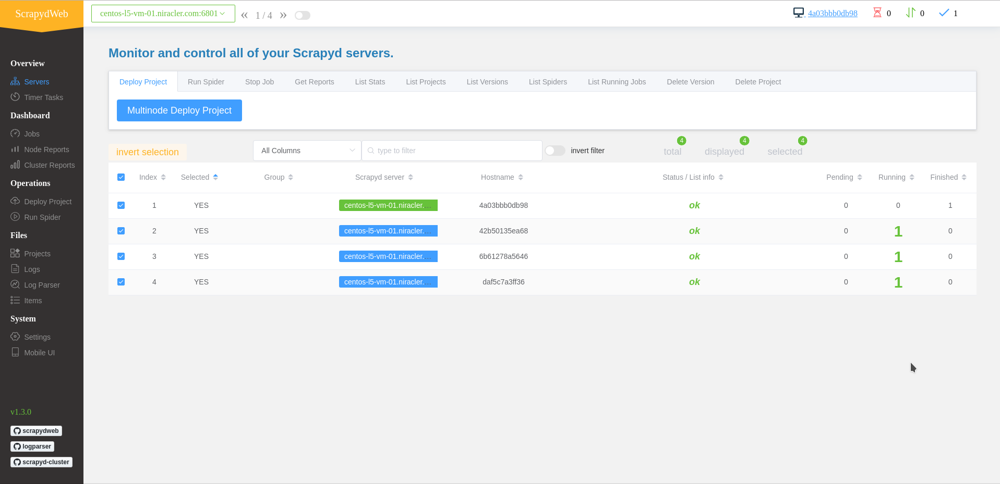

# monitor
监控模块, 基于[scrapydweb](https://github.com/my8100/scrapydweb)

## 自定义监控模块的安装及启动

```shell script
$ flask run --port=5555 --host=0.0.0.0
```

## 效果图



## 爬虫监控的安装及启动

### 使用 docker swarm 模式启动

```shell script
$ make network # 构建网络
$ make spider-nginx # 构建 nginx 反向代理
$ make scrapyd-image # 构建并上传scrapyd镜像
$ make webui-image # 构建并上传webui镜像
$ make spider
```

## 可能需要的操作

主要是第一次的时候需要

### CentOS7 关闭防火墙

```bash
$systemctl stop firewalld.service # 关闭
$systemctl disable firewalld.service # 禁止开机启动
```

### docker swarm 模式分布式部署

初始化 swarm 集群, 然后将子节点连上

```bash
$docker swarm init
```

### 修改hostname

```bash
$sudo hostnamectl set-hostname <newhostname>
```

### 测试redis以及mongodb

redis

```bash
$sudo pacman -S redis # 安装redis
$redis-cli -h centos-l5-vm-01.niracler.com  -p 6379 -a 123456
$SET runoobkey redis  #OK
$redis 127.0.0.1:6379> GET runoobkey #"redis"
```

mongodb [客户端下载](https://robomongo.org/download)

## 假如使用自制镜像，需要以下操作

```bash
docker pull registry:latest
```

等待下载完成之后， 运行这个镜像：

```bash
docker run \
  --detach \
  --name registry \
  --hostname registry \
  --volume /home/niracler/registry:/var/lib/registry/docker/registry \
  --publish 5009:5000 \
  --restart unless-stopped \
  registry:latest
```

每一台电脑上都要运行这命令

```bash
tee /etc/docker/daemon.json <<-'EOF'
{
  "registry-mirrors": [
  "https://kfwkfulq.mirror.aliyuncs.com",
  "https://2lqq34jg.mirror.aliyuncs.com",
  "https://pee6w651.mirror.aliyuncs.com"
  ],
  "insecure-registries" : ["127.0.0.0/8","192.168.0.0/16","172.16.0.0/12","10.0.0.0/8"]
}
EOF
```

重启docker

```bash
systemctl daemon-reload
systemctl restart docker
```

## 参考文章

- [my8100/scrapydweb](https://github.com/my8100/scrapydweb)
- [使用 Docker Swarm 搭建分布式爬虫集群](https://www.kingname.info/2018/10/13/use-docker-swarm/)
- [分布式网络数据抓取系统设计与实现](https://www.jianshu.com/p/fb028ad74798)
- [分布式爬虫的部署之Scrapyd分布式部署](https://juejin.im/post/5b0e1a8ff265da092100709f)
- [Scrapyd手册](https://scrapyd.readthedocs.io/en/stable/install.html)
- [Flask-RESTful](https://flask-restful.readthedocs.io/en/latest/index.html)
- [Flask-PyMongo](https://flask-pymongo.readthedocs.io/en/latest/)
- [What is the difference between a string and a byte string?](https://stackoverflow.com/questions/6224052/what-is-the-difference-between-a-string-and-a-byte-string/31322359)
- [flask-apispec](https://flask-apispec.readthedocs.io)
- [TypeError: ObjectId('') is not JSON serializable](https://stackoverflow.com/questions/16586180/typeerror-objectid-is-not-json-serializable)